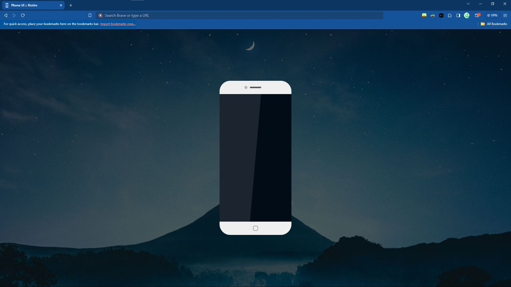
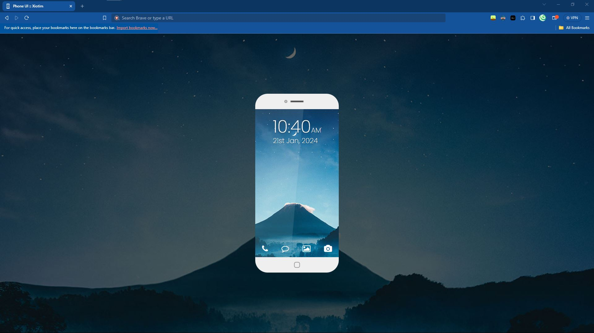

# Phone (xPhone-UI)

This is a clone of the UI of something like iOS or Android. This is just for showcase, and maybe you can learn a little about emulated UI.

The assets can be found: [here](https://codepen.io/irshad1991/pen/ErYdaj)

**(Thanks Online Tutorials!)**

## Acknowledgements

- Tutorial by: [Online Tutorials](https://www.youtube.com/@OnlineTutorialsYT)
- Huge shout-out to my youngest project as of writing this: [XInterest](https://github.com/l-xdt/xinterest) and [xLinks](https://github.com/l-xdt/xLinks)
- A huge help in this project: [DiffChecker](https://www.diffchecker.com/)

## Authors

- [Leidenschaft-Xiotim Development Team](https://github.com/l-xdt/)

- [Alvin Maranx, II ツ (Avun)](https://github.com/avunii/)

- [Online Tutorials](https://www.youtube.com/@OnlineTutorialsYT)

## Demo

There is a demo on this project! and I am not being indirect, here is the link click [here](https://l-xdt.github.io/phone/)

## Features

- Change the code.

- Change the Font set.

- Change the fonts and icons used.

- Change the Wallpapers.

- Change the code.

- Cross platforms.

- **PS:** A little more features can be added, but you need to discover it on your own.

## Screenshots






**Written in plain HTML, CSS and JavaScript. The rest, you must figure out.**

## Run Locally

Clone the project - and run it with XAMPP

```bash
  git clone https://github.com/l-xdt/phone/
```

Go to the project directory

```bash
  cd phone
```

Install dependencies

```bash
  chocalatey install xampp
```

Start the server

```bash
    [Directory]/[ServerName]/apache-start.bat
```

**PS:** If you trust your web skills, here is a manual on how to self-host a doamin [here](https://www.youtube.com/watch?v=_eQGAJVtRCs) (by Soeng Souy)

## Roadmap

- Additional browser support.

- Change the code.

- Change the font-set.

- Change the Wallpapers.

- Change the fonts and icons used.

- Change the FavIcon, inspired (of-course) by our Signature: **X**

- **Written in Vanilla HTML, CSS and JavaScript.**

## Support

For support, either of our emails: [this one](mailto:trowesigames@gmail.com) or [this one](mailto:leidenschaft.tech@hotmail.com) or join our Discord Server: which is not up as of writing this.

## Feedback

This still applies to feedback aswell, Whether you want to give us positive words, or negative ones, send away (but please only send constructive critisism).

Send away: [here](mailto:trowesigames@gmail.com) or [here](mailto:leidenschaft.tech@hotmail.com).

## FAQ

**Now, my fav FAQ!**

#### Can I modify this to fit my needs?

Yeah! That is why we make these repositories for. For you! To tinker, and to try new things!

#### Can I host this? If I can how?

You can! with my favourite Apache Container, XAMPP! Since I have explained it atleast 14 times, We can skip it.

Here is a [download](https://www.apachefriends.org/download.html) to the XAMPP. And if you are struggling about, you can start with this [tutorial](https://www.youtube.com/watch?v=LzucEZh4_no) (by MainlyWebStuff).

And if you trust your web skills, you can use this [tutorial](https://www.youtube.com/watch?v=_eQGAJVtRCs) (by Soeng Souy) to self-host a domain.

## Used By

This project is used by the following companies:

- LeidenSchaft-Xiotim Accquistions (Limited).

- XDT-Studium.

- Xiotim Development Team [Limited] (XDT).

- XDT-noHesi.

## Related

Here are some related projects:

- [XioTok](https://github.com/l-xdt/xiotok/)

- [noHesi](https://github.com/l-xdt/no-hesi/)

- [Xirox](https://github.com/l-xdt/xirox/)

- [Studium](https://github.com/l-xdt/studium/)

- [XioTim](https://github.com/l-xdt/xiotim/)

- [XioTube](https://github.com/l-xdt/xiotube/)

- [xSocial](https://github.com/l-xdt/xSocial/)

- [XGram](https://github.com/l-xdt/xgram/)

- [XChat](https://github.com/l-xdt/xchat/)

- [XCord](https://github.com/l-xdt/xcord/)

- [XApp](https://github.com/l-xdt/xapp/)

- [Xelegram](https://github.com/l-xdt/xelegram/)

- [XInterest](https://github.com/l-xdt/xInterest/)

- [xLinks](https://github.com/l-xdt/xLinks/)

- [Phone (xPhone-UI)](https://github.com/l-xdt/phone/)

## Documentation

- Although I cannot tell you all about this project (yet), you can go and check out the tutorial, linked below:

- [Phone UI Clone](https://www.youtube.com/watch?v=_22wyaIWA5Y) by Online Tutorials.

## API Reference

As earlier mentioned there are no APIs only, jQuery, and barely used. This is a very base-level project. If there is any, I will update this readMe.
